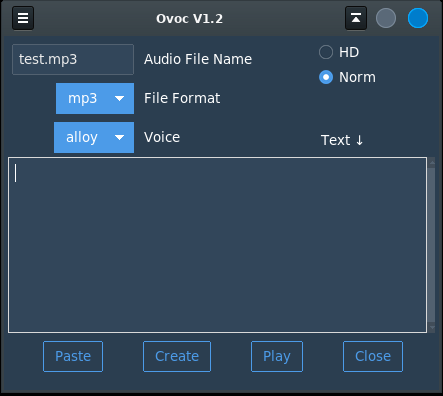

# Ovoc
### OpenAI Voice Desktop App
#### Python - tkinter - openai API

Ovoc uses the OpenAI audio.speech API with several speech parameters
to convert text into speech in the form of an audio file. The quality
of the speech produced is more lifelike than that of previous 
text-to-speech technologies.

Explanation of the 
[API parameters](https://platform.openai.com/docs/api-reference/audio/createSpeech "openai audio.speech")




```bash
$ python3 ovoc.py

```

#### Required Modules

- openai
- ttkbootstrap

#### Other Requirements

> OpenAI Key  
configured in your OS environment as `GPTKEY`.

#### The 'Play' Button

On Linux:  
> The program utility 'play' (SoX) plays back the audio file.

On Windows:
> The audio file is played back by the systems media player.


